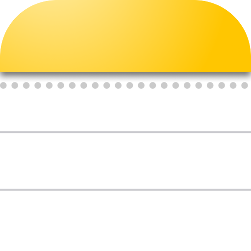

<p align="center">
  
</p>

<h1 align="center">Bello Notes</h1>

A fast, private, cross-platform notes app built with Flutter. Rich-text notes
with folders, tables, images and checklists — stored locally in SQLite, with no
account and no cloud lock-in.

> Open source, made by [@soufianeblog](https://x.com/soufianeblog).

---

## Screenshots

| Light theme | Dark theme | Right-to-left (Arabic) |
|:---:|:---:|:---:|
| [](https://raw.githubusercontent.com/soufianeblog/bellonotes/main/resources/screenshots/1.png) | [](https://raw.githubusercontent.com/soufianeblog/bellonotes/main/resources/screenshots/2.png) | [](https://raw.githubusercontent.com/soufianeblog/bellonotes/main/resources/screenshots/3.png) |

---

## Features

- **Rich text editor** — headings, bold/italic/underline, colours, highlights,
  checklists, alignment, fonts and font sizes (powered by `flutter_quill`).
- **Tables & images** — insert tables with per-cell colours, and resizable,
  linkable images.
- **Folders & trash** — organise notes into folders, multi-select, and recover
  from a trash bin before permanent deletion.
- **Local-first storage** — everything lives in a local SQLite database; images
  are stored alongside it. No sign-in, no telemetry.
- **Export / import** — back up or move everything as a single `.zip` archive.
- **Markdown & HTML** — paste/convert between rich text, Markdown and HTML.
- **Localized** — English, French, Spanish, Italian, Arabic and Chinese.
- **Adaptive UI** — desktop (resizable sidebars), tablet, and mobile layouts,
  with light/dark themes and custom accent colours.

## Supported platforms

| Platform | Status | Artifact |
|----------|--------|----------|
| macOS    | ✅ | `.app` bundle |
| Windows  | ✅ | `.exe` + bundle |
| Android  | ✅ | `.apk` |
| Linux    | ✅ | bundle + `.desktop` launcher |
| Web      | ✅ | static site (`build/web/`) |
| iOS      | ⚙️ buildable | `.app` (no installer script) |

On the web, storage uses an IndexedDB-backed SQLite database (compiled to
WebAssembly) instead of a native SQLite file, image attachments are stored
inline in the note, and export/import use a browser download / file upload — so
your notes still live entirely in your own browser, with no account or server.

---

## Install (one line)

The installer scripts bootstrap everything they need — Flutter and the platform
build tools — then build and install the app. By default they prompt before
installing any tool and before placing the app on your system. Each example
below comes in two forms: **interactive** (asks before each step) and
**unattended** (passes `--yes` / `-Yes` to assume "yes" to every prompt).

### macOS / Linux

```bash
# Interactive
curl -fsSL https://raw.githubusercontent.com/soufianeblog/bellonotes/main/scripts/install.sh | bash

# Unattended (note the `-s --` to forward the flag to the script)
curl -fsSL https://raw.githubusercontent.com/soufianeblog/bellonotes/main/scripts/install.sh | bash -s -- --yes
```

### Windows (PowerShell)

```powershell
# Interactive
irm https://raw.githubusercontent.com/soufianeblog/bellonotes/main/scripts/install.ps1 | iex

# Unattended (build a script block so the -Yes flag can be passed)
& ([scriptblock]::Create((irm https://raw.githubusercontent.com/soufianeblog/bellonotes/main/scripts/install.ps1))) -Yes
```

### Android

From a checkout (with a phone connected and USB debugging enabled):

```bash
# Interactive
./scripts/install.sh --platform android         # macOS / Linux
.\scripts\install.ps1 -Platform android          # Windows

# Unattended
./scripts/install.sh --platform android --yes    # macOS / Linux
.\scripts\install.ps1 -Platform android -Yes      # Windows
```

### Web

Builds the static web app into `build/web/` and offers to serve it locally:

```bash
# Interactive (builds, then offers to serve at http://localhost:8080)
./scripts/install.sh --platform web              # macOS / Linux
.\scripts\install.ps1 -Platform web               # Windows

# Unattended (build only, no local server)
./scripts/install.sh --platform web --yes        # macOS / Linux
.\scripts\install.ps1 -Platform web -Yes          # Windows
```

See [Deploy (Web)](#deploy-web) below to publish the build to a static host.

The script builds a release APK and, if a device is detected over `adb`, offers
to install it. Otherwise it prints the APK path so you can copy it to your phone.

### What the installer does

1. Detects (or clones) the repository into `~/bellonotes`.
2. Checks for Flutter and the platform toolchain; offers to install anything
   missing (Homebrew/winget/your Linux package manager).
3. Runs `flutter pub get` and a `--release` build.
4. Asks where to install and copies the app there, creating a launcher:
   - **macOS** → `/Applications/Bello Notes.app`
   - **Windows** → `%LOCALAPPDATA%\Programs\Bello Notes` + Start Menu shortcut
   - **Linux** → `~/.local/lib/bellonotes` + `~/.local/share/applications` entry
   - **Android** → installs to the connected device, or prints the APK path

Useful flags: `--help`, `--yes` (`-Yes`), `--no-install` (`-NoInstall`),
`--platform` (`-Platform`).

---

## Build from source (manual)

If you'd rather not use the installer:

```bash
# 1. Install Flutter (stable):  https://docs.flutter.dev/get-started/install
flutter --version

# 2. Clone and fetch dependencies
git clone https://github.com/soufianeblog/bellonotes.git
cd bellonotes
flutter pub get

# 3. Run in development
flutter run

# 4. Or build a release artifact for your platform
flutter build macos --release      # → build/macos/Build/Products/Release/Bello Notes.app
flutter build windows --release    # → build/windows/x64/runner/Release/
flutter build linux --release      # → build/linux/<arch>/release/bundle/
flutter build apk --release        # → build/app/outputs/flutter-apk/app-release.apk
flutter build web --release        # → build/web/

# Run the web app locally during development
flutter run -d chrome              # or: flutter run -d web-server --web-port 8080
```

Run `flutter doctor` to confirm your platform toolchain is set up.

### Tests & analysis

```bash
flutter analyze
flutter test
```

---

## Deploy (Web)

`flutter build web --release` produces a self-contained static site in
`build/web/` (HTML/JS/CSS plus the bundled SQLite WebAssembly worker —
`sqlite3.wasm` and `sqflite_sw.js`). Upload that folder to any static host. It
**must be served over HTTP(S)** — opening `index.html` as a `file://` URL won't
work because the SQLite web worker can't load.

```bash
flutter build web --release
```

Then deploy `build/web/`:

- **GitHub Pages** — push the contents of `build/web/` to a `gh-pages` branch (or
  a `/docs` folder on `main`) and enable Pages. If hosting under a sub-path
  (e.g. `https://user.github.io/bellonotes/`), build with a matching base href:
  `flutter build web --release --base-href /bellonotes/`.
- **Netlify / Vercel** — set the build command to `flutter build web --release`
  and the publish directory to `build/web`.
- **Firebase Hosting** — `firebase init hosting` with public dir `build/web`,
  then `firebase deploy`.
- **Any static server / CDN / S3 / nginx** — serve the `build/web/` directory
  as-is.

Quick local preview of a production build:

```bash
cd build/web && python3 -m http.server 8080   # then open http://localhost:8080
```

---

## Project structure

```
lib/
  main.dart                 App entry point, theme, providers, localization
  l10n/strings.dart         Lightweight in-app localization table
  models/                   Plain data models (Note, Folder) + (de)serialization
  providers/                ChangeNotifier state: settings, notes, folders
  screens/                  Full-page UIs: home, settings, about, error log
  widgets/                  Reusable UI: editor, folder sidebar, notes sidebar
  services/                 Non-UI logic: SQLite, export/import, HTML, logging
  platform/                 Platform bridge (native vs web) via conditional imports
  utils/                    Small web-safe helpers (e.g. desktop chrome detection)
scripts/                    One-command installers (install.sh / install.ps1)
test/                       Unit & widget tests
```

A short header at the top of each Dart file explains that file's role, and
public classes and methods carry doc comments.

---

## Contributing

Issues and pull requests are welcome. Please run `flutter analyze` and
`flutter test` before opening a PR, and keep the existing comment style
(a one-line purpose header per file, doc comments on public APIs).

## License

Released under the MIT License — see [LICENSE](LICENSE).

## Support / Donate

Bello Notes is free and open source. If it's useful to you and you'd like to
support its development, you can buy me a coffee:

[](http://paypal.me/paysoufiane)

> ❤️ [paypal.me/paysoufiane](http://paypal.me/paysoufiane)
